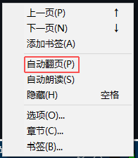
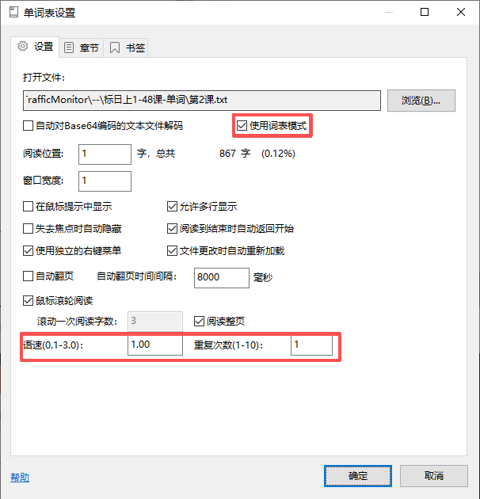

# WordList for TrafficMonitor

一个基于 [TextReader](https://github.com/zhongyang219/TrafficMonitorPlugins/releases/tag/TextReader_V1.02) 修改而来的 TrafficMonitor 插件，增加**词表背诵/朗读**场景进行了优化。

> **⚠️ 声明**：本人没有任何编程基础，本项目代码均由 AI 修改完成。后续大概率不会有任何更新或 Bug 修复，请见谅。如果发现问题，建议自行 fork 后修改，或寻找其他替代方案。

> 仅测试过日语词汇，其他语言未测试


---

## 添加功能

| 功能 | 说明 |
|------|------|
| **词表模式** | 在设置中开启后，会自动识别 `单词&翻译` 格式的词表，并拆分为原文/翻译两部分 |
| **双击发音** | 双击插件区域即可朗读当前单词，先用原文语言朗读，再用翻译语言朗读（发音会跳过括号内的原文/词性） |
| **自动朗读** | 开启自动翻页时同步朗读每个单词，无需手动双击 |
| **智能过滤** | 自动过滤原文中的括号注释（如 `ちゅうごくじん（中国人）` → 只读 `ちゅうごくじん`，以及翻译中的词性标记（如 `〔名〕中国人` → 只读 `中国人`） |
| **阅读记忆** | 词表模式下会记录当前阅读位置，关闭插件后再次打开会从上次位置继续 |
| **语速调节** | 支持调节朗读语速；单词朗读时会自动稍慢一点（约为设置语速的 85%），方便听清 |





---

## 使用前提

1. **安装 [TrafficMonitor](https://github.com/zhongyang219/TrafficMonitor)**
2. **在 Windows 系统设置中添加对应的语音语言包**（例如要朗读日语/中文，需在"设置 → 时间和语言 → 语言和区域"中安装对应的语音包）
    
    觉得下载的语言包发音太机械的话可以试试NaturalVoice添加在线语音，参考这两篇文章：

   * [win10添加微软离线自然语音合成](https://blog.csdn.net/FL1623863129/article/details/149852228)（只用看到NaturalVoice设置完成后就行）
   * [更换微软TTS语音引擎切换](https://blog.csdn.net/FL1623863129/article/details/149852228?fromshare=blogdetail&sharetype=blogdetail&sharerId=149852228&sharerefer=PC&sharesource=XiHua_0522&sharefrom=from_link)

---

## 安装方法

1. 下载 `WordList_dll.zip`：
2. 将 `WordList.dll` 放入 TrafficMonitor 安装目录下的 `plugins` 文件夹中
3. 重启 TrafficMonitor，在"选项 → 插件"中启用 WordList 并添加显示项目

---

## 词表文件格式

词表文件支持如下格式，每行一个单词：

```text
单词（翻译）
单词（翻译）
```

示例：

```text
わたし（我）
あなた（你）
ちゅうごくじん（中国人）
にほんじん（日本人）
```

在插件设置中勾选**"使用词表模式"**即可自动识别该格式。
词表模式下窗口宽度会变为自适应宽度，以方便展示过长单词
---

## 自动朗读使用说明

1. 在插件上**单击鼠标右键**，勾选 **"自动翻页"**
2. 同样在右键菜单中勾选 **"自动朗读"**
3. 在设置中调节**自动翻页时间间隔**，建议设置得**长一些**（例如 5~10 秒以上），让每个单词有足够时间发音
4. 可选：在设置中勾选**"词表模式"**，并可自定义每个单词朗读的重复次数

> **注意**：自动朗读必须配合自动翻页同时开启才会生效。

---

## 编译环境

- Visual Studio 2022
- MFC / C++
- Windows SDK 10.0

用 VS2022 打开 `TrafficMonitorPlugins.sln`，编译 `TextReader`（输出文件名为 `WordList.dll`）即可。

---

## 鸣谢

- [zhongyang219](https://github.com/zhongyang219) / [TrafficMonitorPlugins](https://github.com/zhongyang219/TrafficMonitorPlugins)
